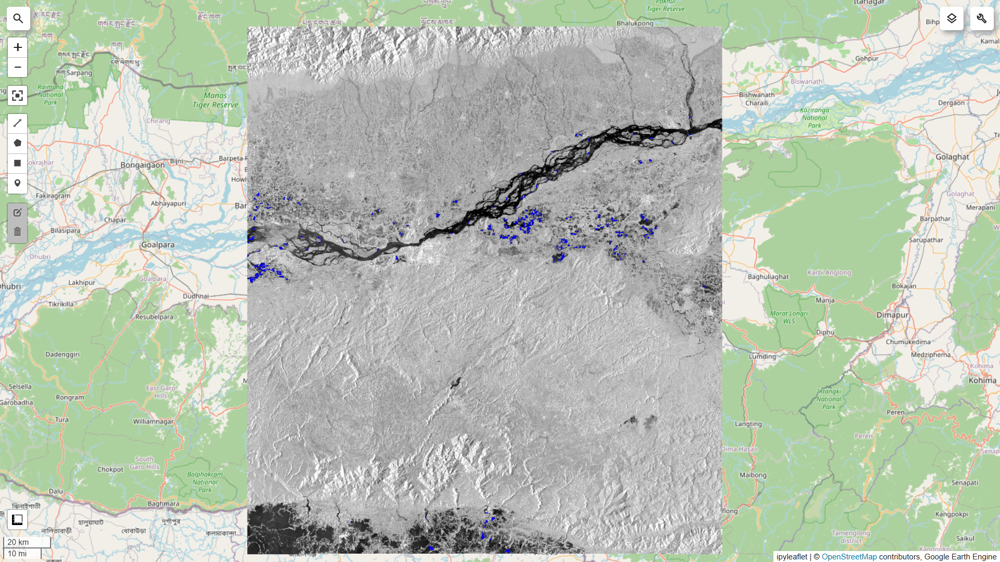

\# 🌊 Flood Detection using Google Earth Engine (Python)


<p align="center">

&#x20; 

</p>


<p align="center">

&#x20; <b>Detecting flood-affected regions using Sentinel-1 SAR satellite data</b>

</p>


\---


\## 📌 Overview


This project uses \*\*Synthetic Aperture Radar (SAR)\*\* data from Sentinel-1 to detect flood-affected areas.

By comparing pre-flood and post-flood satellite images, the model identifies newly inundated regions and estimates total flood extent.


\---


\## ⚙️ Methodology


1\. Collect Sentinel-1 SAR data (VV polarization)

2\. Generate \*\*Before\*\* and \*\*After\*\* composite images

3\. Apply backscatter thresholding to detect water

4\. Remove permanent water using JRC dataset

5\. Apply noise filtering (connected pixel analysis)

6\. Perform spatial smoothing for better region continuity

7\. Calculate flood area using pixel-based estimation


\---


\## 📊 Results


\* \*\*Estimated Flood Area:\*\* \~550 sq km

\* \*\*Region:\*\* Assam, India

\* Flood regions align with river basins and floodplains


\---


\## 🛰️ Technologies Used


\* Python

\* Google Earth Engine API

\* Geemap

\* Sentinel-1 SAR Data


\---


\## 🚀 How to Run


```bash

pip install earthengine-api geemap

```


```python

import ee

ee.Authenticate()

ee.Initialize()

```


```bash

python flood\_detection.py

```


\---


\## 🧠 Key Learnings


\* SAR-based flood detection using backscatter analysis

\* Handling speckle noise in satellite imagery

\* Spatial filtering and smoothing techniques

\* Cloud-based geospatial analysis with Earth Engine


\---


\## 🔮 Future Improvements


\* NDVI-based vegetation damage analysis

\* Multi-date flood progression tracking

\* Machine learning-based classification

\* Integration with real-time disaster monitoring


\---


\## 👩‍💻 Author


\*\*Shivani Negi\*\*

GitHub: https://github.com/kmshivani05


